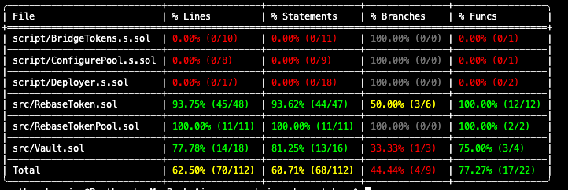

# Cross-Chain Rebase Token

A cross-chain compatible rebase token implementation using Chainlink CCIP (Cross-Chain Interoperability Protocol) that preserves user-specific interest rates across multiple blockchain networks.

## Overview

This project implements a rebase token system where users can deposit ETH into a vault, receive interest-bearing tokens that automatically accrue value over time, and seamlessly transfer these tokens across different blockchain networks while maintaining their individual interest rates.

### Key Features

-   **Interest-Bearing Tokens**: Automatically accrue interest based on user-specific rates
-   **Early Adopter Advantage**: Users lock in the global interest rate at deposit time
-   **Cross-Chain Transfers**: Transfer tokens between chains while preserving interest rates
-   **Decreasing Rate Model**: Global interest rate can only decrease, rewarding early depositors
-   **Burn & Mint Mechanism**: Uses burn/mint token pool for cross-chain operations

## Test Coverage (Scripts are not tested)



## Architecture

### Core Contracts

#### 1. RebaseToken.sol

The main ERC20 token with rebasing functionality. Key characteristics:

-   Inherits from OpenZeppelin's ERC20, Ownable, and AccessControl
-   Dynamic balance calculation: `balanceOf()` returns principal + accrued interest
-   User-specific interest rates locked at deposit time
-   Linear interest accrual based on time elapsed
-   Role-based minting and burning for cross-chain operations

#### 2. Vault.sol

Entry point for users to interact with the protocol:

-   Accepts ETH deposits and mints RebaseToken 1:1
-   Handles redemptions by burning tokens and returning ETH
-   Simple interface for deposit and redeem operations

#### 3. RebaseTokenPool.sol

Custom Chainlink CCIP token pool implementing burn/mint mechanism:

-   Handles token locking/burning on source chain
-   Manages token releasing/minting on destination chain
-   Preserves user interest rates during cross-chain transfers
-   Integrates with CCIP Router and Risk Management Network

## Cross-Chain Token Transfer Architecture

### Components

The cross-chain system uses Chainlink's CCIP infrastructure with custom token pools:

**TokenPool (Base Contract)**

-   Provides validation logic for lock/burn and release/mint operations
-   Manages chain configurations and allowlists
-   Implements rate limiting for security
-   Connects with CCIP Router for cross-chain messaging

**Pool Library**
Defines the data structures for token pool operations:

```solidity
struct LockOrBurnInV1 {
    bytes receiver;              // Receiver address on destination chain
    uint64 remoteChainSelector;  // Destination chain ID
    address originalSender;      // Transfer initiator
    uint256 amount;              // Amount to lock/burn
    address localToken;          // Token address on source chain
}

struct LockOrBurnOutV1 {
    bytes destTokenAddress;      // Token address on destination chain
    bytes destPoolData;          // Custom data (user's interest rate)
}

struct ReleaseOrMintInV1 {
    bytes originalSender;        // Original sender on source chain
    uint64 remoteChainSelector;  // Source chain ID
    address receiver;            // Token receiver on destination
    uint256 amount;              // Amount to release/mint
    address localToken;          // Token address on destination
    bytes sourcePoolAddress;     // Pool address on source chain
    bytes sourcePoolData;        // Custom data from source pool
    bytes offchainTokenData;     // Offchain data (untrusted)
}

struct ReleaseOrMintOutV1 {
    uint256 destinationAmount;   // Actual tokens minted/released
}
```

### Cross-Chain Transfer Flow

#### Function Deep Dive: lockOrBurn()

**Purpose**: Executed on the source blockchain when a user initiates a cross-chain token transfer.

**Function Signature**:

```solidity
function lockOrBurn(Pool.LockOrBurnInV1 calldata lockOrBurnIn)
    external
    virtual
    override
    returns (Pool.LockOrBurnOutV1 memory lockOrBurnOut)
```

**Execution Flow**:

**Step 1: Validation** (`_validateLockOrBurn`)

The inherited validation function performs critical security checks:

```solidity
function _validateLockOrBurn(Pool.LockOrBurnInV1 memory lockOrBurnIn) internal {
    // Verify the token being transferred is supported
    if (!isSupportedToken(lockOrBurnIn.localToken)) revert InvalidToken(lockOrBurnIn.localToken);

    // Check if the destination chain is not under RMN curse
    if (IRMN(i_rmnProxy).isCursed(bytes16(uint128(lockOrBurnIn.remoteChainSelector))))
        revert CursedByRMN();

    // Verify sender is on allowlist (if enabled)
    _checkAllowList(lockOrBurnIn.originalSender);

    // Ensure caller is authorized onRamp for destination chain
    _onlyOnRamp(lockOrBurnIn.remoteChainSelector);

    // Consume outbound rate limit capacity
    _consumeOutboundRateLimit(lockOrBurnIn.remoteChainSelector, lockOrBurnIn.amount);
}
```

Key validations:

-   **Token Support**: Prevents unauthorized tokens from being processed
-   **RMN Curse Check**: Risk Management Network can pause cross-chain operations if anomalies detected
-   **Allowlist Verification**: Ensures only approved addresses can transfer (if enabled)
-   **OnRamp Authorization**: Validates the caller is the registered CCIP OnRamp contract for the target chain
-   **Rate Limiting**: Prevents large-scale exploits by limiting token flow per time period

**Step 2: Capture User State**

For rebase tokens, preserving the user's interest rate is critical:

```solidity
uint256 userInterestRate = RebaseToken(address(i_token))
    .getUserInterestRate(lockOrBurnIn.originalSender);
```

This retrieves the user's locked-in interest rate from the RebaseToken contract. This rate was set when the user first deposited and must be preserved across chains to maintain the economic properties of the token.

**Step 3: Burn Tokens**

```solidity
RebaseToken(address(i_token)).burn(address(this), lockOrBurnIn.amount);
```

The burn operation:

1. Calls `_mintAccruedInterest()` to mint any pending interest to the user's principal balance
2. Burns the specified amount from the user's balance
3. Decreases the total supply on the source chain
4. This prevents double-spending across chains

**Step 4: Encode Transfer Metadata**

```solidity
lockOrBurnOut = Pool.LockOrBurnOutV1({
    destTokenAddress: getRemoteToken(lockOrBurnIn.remoteChainSelector),
    destPoolData: abi.encode(userInterestRate)
});
```

The return data contains:

-   `destTokenAddress`: The RebaseToken contract address on the destination chain
-   `destPoolData`: ABI-encoded user interest rate that will be passed to the destination pool

This data is included in the CCIP message and transmitted cross-chain.

**Complete lockOrBurn() Implementation**:

```solidity
function lockOrBurn(Pool.LockOrBurnInV1 calldata lockOrBurnIn)
    external
    virtual
    override
    returns (Pool.LockOrBurnOutV1 memory lockOrBurnOut)
{
    // Validate the operation (token, chain, permissions, rate limits)
    _validateLockOrBurn(lockOrBurnIn);

    // Capture user's interest rate (critical for rebase tokens)
    uint256 userInterestRate = RebaseToken(address(i_token))
        .getUserInterestRate(lockOrBurnIn.originalSender);

    // Burn tokens on source chain
    RebaseToken(address(i_token)).burn(address(this), lockOrBurnIn.amount);

    // Return metadata for destination chain
    return Pool.LockOrBurnOutV1({
        destTokenAddress: getRemoteToken(lockOrBurnIn.remoteChainSelector),
        destPoolData: abi.encode(userInterestRate) // Preserve user's rate
    });
}
```

---

#### Function Deep Dive: releaseOrMint()

**Purpose**: Executed on the destination blockchain when a CCIP message arrives with token transfer instructions.

**Function Signature**:

```solidity
function releaseOrMint(Pool.ReleaseOrMintInV1 calldata releaseOrMintIn)
    external
    virtual
    override
    returns (Pool.ReleaseOrMintOutV1 memory)
```

**Execution Flow**:

**Step 1: Validation** (`_validateReleaseOrMint`)

Similar to lockOrBurn validation but for the destination chain:

```solidity
function _validateReleaseOrMint(Pool.ReleaseOrMintInV1 memory releaseOrMintIn) internal {
    // Verify the token is supported
    if (!isSupportedToken(releaseOrMintIn.localToken)) revert InvalidToken(releaseOrMintIn.localToken);

    // Check RMN curse status
    if (IRMN(i_rmnProxy).isCursed(bytes16(uint128(releaseOrMintIn.remoteChainSelector))))
        revert CursedByRMN();

    // Ensure caller is authorized offRamp for source chain
    _onlyOffRamp(releaseOrMintIn.remoteChainSelector);

    // Validate source pool address matches expected pool
    bytes memory configuredRemotePool = getRemotePool(releaseOrMintIn.remoteChainSelector);
    if (keccak256(releaseOrMintIn.sourcePoolAddress) != keccak256(configuredRemotePool)) {
        revert InvalidSourcePoolAddress(releaseOrMintIn.sourcePoolAddress);
    }

    // Consume inbound rate limit capacity
    _consumeInboundRateLimit(releaseOrMintIn.remoteChainSelector, releaseOrMintIn.amount);
}
```

Key validations:

-   **Token Support**: Ensures token is registered on destination chain
-   **RMN Curse Check**: Verifies no security concerns on destination chain
-   **OffRamp Authorization**: Validates caller is the registered CCIP OffRamp contract
-   **Source Pool Verification**: CRITICAL - prevents spoofed messages by validating the source pool address
-   **Rate Limiting**: Controls inbound token flow to prevent flooding

**Step 2: Decode Transferred State**

Extract the user's interest rate from the cross-chain message:

```solidity
(uint256 userInterestRate) = abi.decode(
    releaseOrMintIn.sourcePoolData,
    (uint256)
);
```

The `sourcePoolData` field contains the ABI-encoded interest rate that was set in `lockOrBurn()` on the source chain. This ensures the user's economic position is preserved.

**Step 3: Mint Tokens with Preserved Rate**

```solidity
RebaseToken(address(i_token)).mint(
    releaseOrMintIn.receiver,
    releaseOrMintIn.amount,
    userInterestRate
);
```

This calls an overloaded mint function that:

1. Mints any pending accrued interest (if user already has balance)
2. Sets the user's interest rate to the preserved rate from source chain
3. Mints the transferred amount to the receiver
4. Increases total supply on destination chain

**Important**: This requires a modified `RebaseToken.mint()` function that accepts the interest rate parameter:

```solidity
function mint(
    address _to,
    uint256 _amount,
    uint256 _userInterestRate
) external onlyRole(MINT_AND_BURN_ROLE) {
    _mintAccruedInterest(_to);
    userInterestRate[_to] = _userInterestRate; // Set preserved rate
    _mint(_to, _amount);
}
```

**Step 4: Return Minted Amount**

```solidity
return Pool.ReleaseOrMintOutV1({
    destinationAmount: releaseOrMintIn.amount
});
```

CCIP's OffRamp contract verifies that the receiver's balance increased by exactly this amount. If the amounts don't match, the entire transaction reverts.

**Complete releaseOrMint() Implementation**:

```solidity
function releaseOrMint(Pool.ReleaseOrMintInV1 calldata releaseOrMintIn)
    external
    virtual
    override
    returns (Pool.ReleaseOrMintOutV1 memory)
{
    // Validate the operation (token, chain, permissions, source pool, rate limits)
    _validateReleaseOrMint(releaseOrMintIn);

    // Decode user's interest rate from source chain
    address receiver = releaseOrMintIn.receiver;
    (uint256 userInterestRate) = abi.decode(
        releaseOrMintIn.sourcePoolData,
        (uint256)
    );

    // Mint tokens with preserved interest rate
    RebaseToken(address(i_token)).mint(
        receiver,
        releaseOrMintIn.amount,
        userInterestRate // User's rate from source chain
    );

    // Return the amount minted for CCIP verification
    return Pool.ReleaseOrMintOutV1({
        destinationAmount: releaseOrMintIn.amount
    });
}
```

---

#### Complete Cross-Chain Transaction Flow

**Visual Flow Diagram**:

```
Source Chain (Ethereum)                    Destination Chain (Polygon)
=====================                      ==========================

User initiates transfer
       ↓
CCIP Router.ccipSend()
       ↓
OnRamp Contract
       ↓
TokenPool.lockOrBurn()
  ├─ _validateLockOrBurn()
  │   ├─ Check token support
  │   ├─ Verify RMN not cursed
  │   ├─ Validate allowlist
  │   ├─ Check onRamp auth
  │   └─ Consume rate limit
  ├─ Get userInterestRate
  ├─ Burn tokens
  └─ Return (destToken, userInterestRate)
       ↓
CCIP Message Created
       ↓
       ├─────────────────────────────────────────────→
                                                      ↓
                                              OffRamp Contract
                                                      ↓
                                          TokenPool.releaseOrMint()
                                            ├─ _validateReleaseOrMint()
                                            │   ├─ Check token support
                                            │   ├─ Verify RMN not cursed
                                            │   ├─ Check offRamp auth
                                            │   ├─ Verify source pool
                                            │   └─ Consume rate limit
                                            ├─ Decode userInterestRate
                                            ├─ Mint tokens to receiver
                                            ├─ Set preserved interest rate
                                            └─ Return destinationAmount
                                                      ↓
                                              Verify balance increase
                                                      ↓
                                              Transfer complete
                                                      ↓
                                          Tokens in receiver's wallet
```

### Complete Transfer Example

**Scenario**: Alice transfers 100 RBT from Ethereum to Polygon with a 5% interest rate.

**On Ethereum**:

1. Alice's interest rate: 5e10 (5%)
2. `lockOrBurn()` burns 100 RBT from Alice
3. Encodes interest rate in `destPoolData`
4. CCIP message created with amount and encoded rate

**Cross-Chain Transmission**:

-   Message travels through CCIP Network
-   Validated by Risk Management Network (RMN)

**On Polygon**:

1. `releaseOrMint()` receives message
2. Decodes interest rate: 5e10
3. Mints 100 RBT to Alice
4. Sets Alice's interest rate to 5e10
5. Alice's tokens continue accruing at her original 5% rate

### Why Custom Token Pool for Rebase Tokens

According to Chainlink CCIP documentation, tokens with rebasing mechanisms require custom pools because:

**Source Chain Requirements**:

-   Must capture the user's "shares" (in our case, the interest rate)
-   Record this information in `destPoolData` for cross-chain transfer
-   Ensure economic properties are preserved

**Destination Chain Requirements**:

-   Must decode the user's shares from `sourcePoolData`
-   Apply the correct interest rate to the user's account
-   Maintain consistency with source chain economics

This implementation ensures users don't lose their privileged interest rates when bridging tokens across chains.

## Interest Rate Mechanics

### Linear Interest Calculation

```solidity
balanceOf(user) = principalBalance * (1 + userInterestRate * timeElapsed) / PRECISION_FACTOR
```

Where:

-   `PRECISION_FACTOR = 1e18`
-   `userInterestRate`: User's locked-in rate (e.g., 5e10 for 5% annual)
-   `timeElapsed`: Seconds since last balance update

### Interest Accrual Events

Interest is minted to principal balance during:

-   Token transfers (sender and recipient)
-   Minting operations
-   Burning operations
-   Cross-chain bridging

### Critical Implementation Detail

The `_mintAccruedInterest()` function must calculate interest BEFORE updating timestamp to avoid circular dependency:

```solidity
function _mintAccruedInterest(address _user) internal {
    // CORRECT: Calculate interest first
    uint256 balanceIncreased = balanceOf(_user) - super.balanceOf(_user);
    userLastUpdatedTimestamp[_user] = block.timestamp;
    _mint(_user, balanceIncreased);

    // WRONG: Updating timestamp first would result in 0 interest
    // userLastUpdatedTimestamp[_user] = block.timestamp; // DON'T DO THIS FIRST
    // uint256 balanceIncreased = balanceOf(_user) - super.balanceOf(_user);
}
```

## Economic Model

### Incentive Structure

1. **Early Adopter Advantage**: Users who deposit when rates are high keep those rates forever
2. **Decreasing Rates**: New deposits get lower rates, encouraging early participation
3. **Continuous Compounding**: Interest accrues every second
4. **Cross-Chain Preservation**: Interest rates maintained across all supported chains

### Rate Decrease Mechanism

```solidity
function setInterestRate(uint256 _newInterestRate) external onlyOwner {
    if (_newInterestRate >= interestRate) {
        revert RebaseToken__NewInterestRateCannotBeEqualOrHigher(_newInterestRate);
    }
    interestRate = _newInterestRate;
    emit InterestRateSet(_newInterestRate);
}
```

### Sustainability Considerations

**Current Implementation Limitations**:

-   Vault holds deposits without yield generation
-   Interest payments create insolvency risk
-   Works for testing but requires modifications for production

**Production Requirements**:

-   Deploy deposits to yield-generating protocols (Lido, Aave, etc.)
-   Interest rates must be lower than generated yield
-   Maintain reserve ratios for redemption liquidity
-   Implement gradual withdrawal limits

## Documentation

-   Foundry Book: https://book.getfoundry.sh/
-   Chainlink CCIP: https://docs.chain.link/ccip
-   OpenZeppelin Contracts: https://docs.openzeppelin.com/contracts

## Usage

### Build

```shell
forge build
```

### Test

Run all tests:

```shell
forge test
```

Run tests with verbosity:

```shell
forge test -vvv
```

Run specific test:

```shell
forge test --mt testTransfer -vv
```

### Test Coverage

```shell
forge coverage
```

### Format

```shell
forge fmt
```

### Gas Snapshots

```shell
forge snapshot
```

### Local Development

Start local Ethereum node:

```shell
anvil
```

### Deploy

Deploy contracts (update script as needed):

```shell
forge script script/Deploy.s.sol:DeployScript --rpc-url <your_rpc_url> --private-key <your_private_key> --broadcast
```

### Interact with Contracts

```shell
cast <subcommand>
```

### Help

```shell
forge --help
anvil --help
cast --help
```

###Test Setup

The test suite uses Foundry's testing framework with:

-   Fuzz testing for input validation (256 runs per test)
-   Time manipulation with `vm.warp()` for interest accrual testing
-   Pranking for access control testing
-   Bounded inputs for realistic test scenarios

## Contract Addresses

**Testnet Deployments** (Update after deployment):

-   Ethereum Sepolia:
    -   RebaseToken: `0x2f9b743e20A0a1a8bA2217262bc221ceD168967b`
    -   Vault: `0xB6d58c290d69bC873c190eEBA4876178db585675`
    -   RebaseTokenPool: `0x8A248ccddeF9656569a9ecAAf33877ea371f6368`
-   Polygon Mumbai:
    -   RebaseToken: `0xBE9417063674e7e86F79FFb0d6769f112e7699D6`
    -   RebaseTokenPool: `0x80911fE0b9b148282CB4751c59f729fA973cd036`

## Dependencies

-   **OpenZeppelin Contracts**: v5.x for ERC20, Ownable, AccessControl
-   **Chainlink CCIP**: For cross-chain functionality
-   **Forge-Std**: Foundry testing utilities

## License

MIT

## Contributing

Contributions are welcome! Please follow these guidelines:

1. Fork the repository
2. Create a feature branch
3. Write tests for new functionality
4. Ensure all tests pass
5. Submit a pull request

## Disclaimer

This code is provided for educational purposes and has not been audited. Do not use in production without:

-   Professional security audit
-   Proper yield generation implementation
-   Adequate testing on testnets
-   Legal and regulatory compliance review

## Contact

For questions or collaboration opportunities, please open an issue on GitHub.
